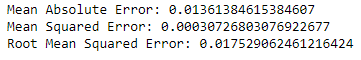
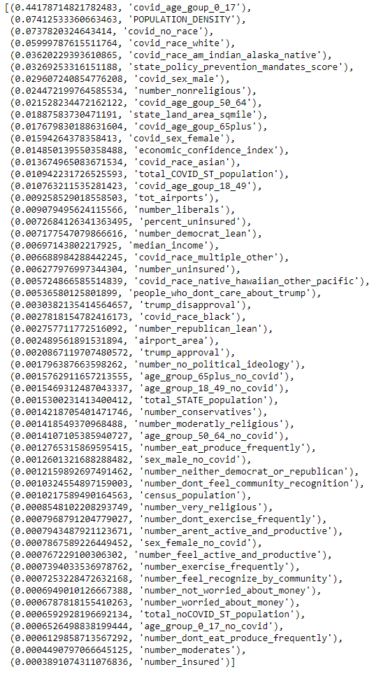
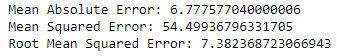
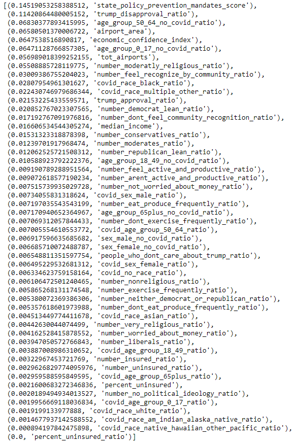
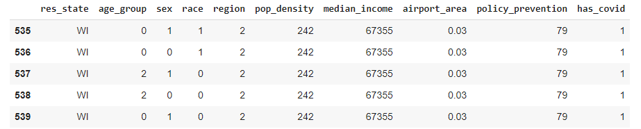
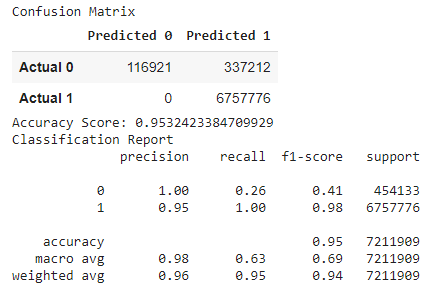
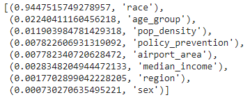

# Coronavirus Pandemic Playbook
_A Project by: David Watson, Dinah Bondzie, Michael Leggett, Kimi Ellerbe, Jack Gross, Yodit Teamir _

## Project Topic, Background, Audience

The term 'pandemic playbook' circulated in the news during the beginning of the COVID-19 pandemic. U.S. President Barack Obama's team had outlined how to respond to infectious diseases and biological incidents so future administrations would be prepared to respond to the next pandemic or biological threat. While the federal government prepared guidelines, state governments from the 50 states + DC were woefully unprepared for a pandemic. The COVID-19 pandemic brought the [deepest recession since the end of WWII](https://www.brookings.edu/research/social-and-economic-impact-of-covid-19/) as the global economy shrunk by 3.5% and [114 million](https://www.weforum.org/agenda/2021/02/covid-employment-global-job-loss/) people lost their jobs in 2020. The impact of this shock is likely to be felt for years to come.

The National Governors Association, a nonpartisan organization comprised of governors in the U.S., tasked with creating an updated playbook for state governments. They have asked us to provide a comprehensive review of factors that led to the spread of COVID-19 cases in states across the United States. We will be presenting our at the next National Governors Association annual conference in late 2021.


### Project Goal
Drawing on data from CDC, U.S. Census, and many other sources, our goal is to determine which social, economic, and political factors contributed to the spread of COVID-19. There is evidence that if states were more prepared to handle a pandemic, economic performance would not have suffered as it did in 2020. Our nation's governors have the opportunity to learn where our state's weak points were that led to these incredible economic losses and mitigate them in a future pandemic. Our team is confident that our machine learning algorithm will predict which factors contributed the most to the spread of respiratory diseases like COVID-19. The information will valuable for state lawmakers' future economic and social political decisions.

### Project Factors 

Given our audience for the project, the data we've obtained for each factor will be organized by state. 

**Target Variable**
* Number of COVID-19 Cases / State Population

**Social Factors**
* Sex
* Age
* Race
* Religion

**Geographical Factors**
* Population Density
* Number of Commercial Airports / State Land Area

**Economic Factors**
* Median Household Income

**Political Factors**
* State Mandates / COVID-19 rules
* Political Leaning

**Lifestyle Factors**
* Health Insurance Coverage 
* Exercise Frequency
* Social Inclusivity 
* Work Life Status
* Monetary Stability

### Questions to Investigate During Project
1. Which social, economic, geographical, lifestyle or political factors contributed the most the spread of the disease?
2. Which category of factor contributed the most the spread of the disease?
3. Is there a connection between state policy or political leaning (i.e. mask mandate) and the spread of COVID-19 within the state
4. Do we need to account for the size of the population that didn't have COVID-19 when using a machine learning model?

### Roles

* **Project Manager**
    * David
* **Database Storage**
    * Dinah
    * Kimi
    * Michael
* **Data Cleaning and Analysis**
    * Dinah
    * Kimi
    * Michael
* **Machine Learning Model**
    * Michael
* **Presentation of Findings**
    * Yodit (Tableau)
    * Jack (Tableau)
    * David (approver) & Team (GitHub)

### Technologies Used

* **Database Storage**
    * pgAdmin - PostgreSQL
    * AWS RDS
* **Data Cleaning and Analysis**
    * Juypter Notebook - Pandas
* **Machine Learning Model**
    * Google Collab Notebook
* **Presentation of Findings**
    * Tableau Public
    * GitHub

### Communication Protocol 

* [Project Checklist](https://docs.google.com/spreadsheets/d/1G9lvPyMrlkjnYT-qGigKpNdVk72A9Zu0Je7hyy8Q6ug/edit?usp=sharing)
* [Group meeting agendas](https://drive.google.com/drive/folders/1sMOLvKQO-S99917fQL9axuocZujgKNZQ?usp=sharing)

We are meeting twice a week outside of class on Zoom and consistently communicating over Slack. David has established best pratices in GitHub, so we don't overwrite each other's work.

## Data Exploration and Analysis Phases

### Data Exploration and Analysis Overview

We began the project by looking at the entirety of COVID-19 CDC data, which consists of 27 million rows and 19 columns of unique patient information. We quickly realized that if we wanted to replicate the spread of COVID-19 based on any factor, we needed to account for the population that didn't have the disease. We established **Number of COVID-19 Cases / State Population** as our target variable. We found ratio would be easier to handle data-wise than working with large population datasets or creating pseudo population data. Next, we moved on to categorical factors. 

For social factors, we looked at U.S. Census data estimates for information on sex, age, and race. We observed that both datasets had either state abbreviations or states spelled out with their full names. We knew we could join data tables by state, so we focused our efforts on finding geographical, economic, lifestyle and political factors with state columns already available.

### Datasets and Sources

* [Joined and cleaned COVID-19 dataset with factors](https://github.com/dwwatson1/coronavirus_pandemic_playbook/blob/main/Resources/COVID_MARCH2020_DEC2020_TOTALS_PROJECT4.csv) 
* [COVID-19 Cases by Age, Sex, Race](https://github.com/dwwatson1/coronavirus_pandemic_playbook/blob/main/Resources/COVID_MARCH2020_DEC2020_TOTALS_PROJECT4.csv) Source: U.S. Census and CDC
* [U.S. Commercial Airports by State](https://github.com/dwwatson1/coronavirus_pandemic_playbook/blob/main/Resources/Group4%20Airport%20By%20Area.csv) Source: FAA
* [State Mask Mandate Policy/Political Affiliation by State](https://github.com/dwwatson1/coronavirus_pandemic_playbook/blob/main/Resources/state_factors_from_gallup.csv) Source: Gallup
* [Median Household Income by State](https://github.com/dwwatson1/coronavirus_pandemic_playbook/blob/main/Resources/household_income_by_state.csv) Source: U.S. Census

### Description of Data Sources

As stated in the Data Exploration subheading, our original dataset consisted of over 27 million rows of unique patient Covid-19 data sourced from the Center for Disease Control and Prevention (CDC) Case Surveillance Public Use Data. Having analyzed the quality of our data, the Team pivoted to finding additional, specific data that would support our model, have minimum missing data and null values and to answer our investigative questions with a unique perspective. Our primary and final dataset will be constructed by merging primary demographic information from the Center of Disease Control & Prevention (CDC), US census data from US Census Bureau and qualitative survey data from Gallup that will consist of 50 rows of State values and 50-55 columns of factors.  

## Database

### Database Schema ERD

Joining factor data by state (see step 7 below):


Joining cleaned CDC data by state (see step 8 below):


### Building the Database

[Database Storing Overview](https://github.com/dwwatson1/coronavirus_pandemic_playbook/blob/main/Resources/Project%204%20Database%20SQL_steps.txt)

**Steps**

1. We chose input data from CDC from March - December 2020 because March marked when the U.S. declared a state of emergency and December was when the first COVID-19 vaccine dose was administered and U.S. Census data, so we replicate the spread of COVID-19 and account for people who didn't have the disease (as mentioned in the Data Exploration section)
2. Because it was such a large dataset, we split it into 4 parts so cleaning it was more manageable. These parts were imported to the table: _CDC_INPUTDB_CLEANED_
3. We also used our data from investigating factors into their respective tables: 
   - household_income_by_state into _ST_INCOME_
   - state_factors_from_gallup into _US_POLITICS_
   - census_sex_no_covid into _CENSUS_SEX_
   - census_age_no_covid into _CENSUS_RACE_
4. After storing the data in pgAdmin - PostgreSQL, we created new tables from _CDC_INPUTDB_CLEANED_ and then segmented age group, state, sex, and race. Here's a review of all the tables we worked with and new columns we created for the final table, for visual, please refer to the ERD above:
   - Table: _DATA_AGE_GROUP, COVID_CASES_AGE_, New columns: _COVID_ and _NO COVID_ for each group: _age_group_0_17, age_group_18_49, age_group_50_64, age_group_65PLUS_
   - Table: _US_STATES_, New columns: none
   - Table: _DATA_SEX, COVID_CASES_SEX, NOCOVID_CENSUS_SEX,_ New columns: _COVID_ and _NO COVID_ for each group: _Male, Female_
   - Table: DATA_RACE, COVID_CASES_RACE, New columns: COVID and _NO COVID_ for each group: _Asian, Black, Multiple/Other, White, American Indian/Alaska Native, Native Hawaiian/Other Pacific Islander, No_identified_race_
   - Table: _US_POLITICS_, New columns: Nearly 30 new political and lifestyle columns with data on information on mask mandates, political party, exercise frequency, sense of community, etc. 
   - Table: _AIRPORT_BY_AREA_, New columns: total airports, state land area (sq. miles), airport area (airports per sq. mile)
   - Table: _ST_INCOME_, New columns: median income
5. We identified that we could join all tables using the states column. Using the table: _US_STATES_, we created the table: _COVID_MARCH2020_DEC2020_PROJECT4_, of totals per state, with calculated data from the table: _CDC_INPUTDB_CLEANED_
6. Using the table: _US_STATES_, we added all the tables with totals, and created the table: _COVID_MARCH2020_DEC2020_TOTALS_PROJECT4_
7. Next, we joined all tables by **state** to input data from all tables to _COVID_MARCH2020_DEC2020_TOTALS_PROJECT4_. 
   - Please refer to the **first ERD image** for the visual of this process
8. Simiarly, with the cleaned CDC_INPUTDB_CLEANED table mentioned in **step 2 and step 3**, we joined the tables by state and input the data to _COVID_MARCH2020_DEC2020_TOTALS_PROJECT4_ as well. 
   - Please refer to the **second ERD image** for the visual of this process
9. We exported our table _COVID_MARCH2020_DEC2020_TOTALS_PROJECT4_ from pgAdmin to the csv file: [COVID_MARCH2020_DEC2020_TOTALS_PROJECT4](https://github.com/dwwatson1/coronavirus_pandemic_playbook/blob/main/Resources/COVID_MARCH2020_DEC2020_TOTALS_PROJECT4.csv)

### Data Dictionary


## ETL Method

### Extracting the Data
Our main dataset was COVID-19 CDC data, which consists of unique patient information spanning 19 columns and 27 million rows. With such a large dataset, we used Amazon S3 to store the data and used Google Colab with Pyspark to access and load the data.

### Transforming the Data
With the data loaded, we could now transform our data. We first filtered the data to be between March 2020 and December 2020. We chose this date range because March 2020 was when the United States declared COVID-19 a pandemic and December 2020 was when the first vaccine was administered in the United States. After filtering the data by date, we dropped many columns from the dataset for either or both of these reasons: 1) there were too many missing values for the variable to be usable and/or 2) the variable was not useful for our analysis. After dropping the unnecessary columns, the data was left with four variables: res_state, age_group, sex, and race. The dataset also had missing values which were identified in the data as either "Missing", "Unknown", or "NA". We replaced all the "Missing" and "Unknown" values to be "NA" for simplicity in identifying the missing values. The data was then exported to a CSV file where it was then imported into SQL for storage and further querying.

### Loading the Data
We used SQL to store the data and query it so that the data would be organized by state with the values becoming our new features. For example, we now have "Male" and "Female" as features of our data with totals of each for each state, whereas in the base CDC data, "sex" was the feature and "Male" and "Female" were values for the unique patients. The other features we are using were imported from their respective CSV files and joined to this main table. Using the U.S. Census data, we were able to create the features for those who do not have COVID by subtracting the number of people with COVID by the total numbers for each state. For example, to find the total number of females who do not have COVID for the state of Maryland, we subtracted the total number of females with COVID from the total population of the state of Maryland.

### Handling Missing Values
The CDC dataset we used had many missing values for the patients age, sex, and race. This is to be expected as many people opt out of providing such information. Because machine learning models cannot run with null values, we had to find a way to handle the missing values. We came up with four possible strategies:

1. Delete the observations with missing values.
2. Delete the variable.
3. As the features with missing values are categorical variables, we could impute the missing values by using the mode.
4. We can predict the missing values for the categorical variables by using a classification model. We would split the data as such:
  - y_train: rows from data with non null values
  - y_test: rows from data with null values
  - X_train: Dataset except data features with non null values
  - X_test: Dataset except data features with null values

We did not want to delete observations as that would mean less data and also would misrepresent the total number of COVID cases. We also did not want to delete the variables as we felt age, sex, and race are important variables for understanding the spread of COVID. For age and sex, we decided to impute the missing values with the mode, as both variables had very low numbers of missing values (1% and 3% respectively). Race, however, had about 42% of missing data. Imputing the data with the mode would not be effective here as a few states had no race data at all. However, we felt that even though there were many missing values for race, the lack of data has something to show for itself. There is strong analysis that can be made on why that data is missing and exposes the weaknesses in data collection on behalf of the CDC and state governments, demonstrating how disjointed states were in their response to COVID and data collection, and on such a crucial factor such as race. That being said, the missing values still had to be accounted for in order for the data to be run through a machine learning model. Therefore, the total number of missing values for each state were put into its own column.

We also were originally going to look at data for all 50 US states and DC. Unfortunately, the Gallup data that we are using for most of our features recorded no data for DC and we therefore had to remove DC from our dataset. We had to drop Delaware, Louisiana, Mississippi, North Dakota, and Wyoming because they either had no data for race or their numbers for race were extremely inaccurate. We also had to drop Michigan, Missouri, Kentucky, Rhode Island, South Dakota, Texas, and West Virginia as their COVID numbers were also exteremely inaccurate and way under what they should have been in the period between March 2020 and December 2020.

## Machine Learning

### Model Choice
The model we chose to use is a **supervised random forest regression model.** We chose supervised machine learning because we have labeled data (our features in tabular form) and outputs. The input data, or our features, has a paired outcome which is plugged in to train the model to predict outcomes. Supervised machine learning models have target variables, or dependent variables, about which we want to gain a deeper understanding. In our case our target variable is how much effect COVID had on a state's population by looking at the total number of COVID cases divided by the total state population.

We chose a random forest algorithm because it can handle many input variables of which we have many. The algorithm can run efficiently on large datasets, and most importantly, random forest models can be used to rank the importance of input variables. This fits the question we are trying to answer perfectly - **what are the top factors that influence the spread of COVID?** A random forest model will help us rank the most influential factors. Since we have a large dataset with many features, as well as both continuous and categorical non-linear variables, a random forest algorithm will be more efficient and more accurate than a simple linear regression. While a large number of trees in a random forest algorithm can be slow requiring a lot of computational power and resources, the advantages outweigh the disadvantages.

### Code for Random Forest Model

[Link to COVID-19 Machine Learning Notebook](https://github.com/dwwatson1/coronavirus_pandemic_playbook/blob/main/covid_ml.ipynb)

To create the random forest model, we first initialize the dependencies, notably the 'from sklearn.ensemble import RandomForestRegressor'.

```
import pandas as pd
import numpy as np
from path import Path
from sklearn.ensemble import RandomForestRegressor
from sklearn.preprocessing import StandardScaler
from sklearn.model_selection import train_test_split
from sklearn import metrics
```

After loading in the data, we use one hot encoding to account for null values and convert categorical variables to integer data.

```
file_path = ("COVID_MARCH2020_DEC2020_TOTALS_PROJECT4.csv")
covid_df = pd.read_csv(file_path)

covid_cat = covid_df.dtypes[covid_df.dtypes == "object"].index.tolist()

from sklearn.preprocessing import OneHotEncoder
enc = OneHotEncoder(sparse=False)
encode_df = pd.DataFrame(enc.fit_transform(covid_df[covid_cat]))

encode_df.columns = enc.get_feature_names(covid_cat)
encode_df.head()
```

We then merge the one hot encoded features to the main dataframe and drop the originals.

```
covid_df = covid_df.merge(encode_df, left_index=True, right_index=True)
covid_df = covid_df.drop(covid_cat,1)
covid_df
```

We split our preprocessed data into our features and target variables.

```
y = covid_df["case_pop"].ravel()
X = covid_df.copy()
X = X.drop("case_pop", axis=1)
```

We then split the data into training and testing sets and scale the data. We set random_state to a number in the testing phase so that we can consistently see the same results when the test model is run (this could possibly be removed for the final model).

```
X_train, X_test, y_train, y_test = train_test_split(X, y, random_state=1)

scaler = StandardScaler()

X_scaler = scaler.fit(X_train)

X_train_scaled = X_scaler.transform(X_train)
X_test_scaled = X_scaler.transform(X_test)
```

We initialize the random forest regressor and fit the model. We set n_estimators to 128 because best practice is to use between 64 and 128 forests. Generally, the higher the number, the stronger and more stable the predictions are. Given that this is a test model, it is reasonable to assume the model might be able to handle 128 forests.

```
rf_model = RandomForestRegressor(n_estimators=128, random_state=1) 

rf_model = rf_model.fit(X_train_scaled, y_train)
```

We make predictions and then evaluate performance using the Mean Absolute Error, Mean Squared Error, and the Root Mean Squared Error.

```
y_pred = rf_model.predict(X_test_scaled)

print('Mean Absolute Error:', metrics.mean_absolute_error(y_test, y_pred))
print('Mean Squared Error:', metrics.mean_squared_error(y_test, y_pred))
print('Root Mean Squared Error:', np.sqrt(metrics.mean_squared_error(y_test, y_pred)))
```



The mean absolute error is the average of all absolute errors. Absolute errors are calculated by subtracting the measured value and "true" value. Our mean absolute error is very low at only 0.0136. The mean squared error tells us how close a regression line is to a set of points. Our mean squared error was extremely low which means we were able to find the line of best fit. The root mean squared error is the standard deviation of the prediction errors. Our root mean squared error was only 0.0175 which again is very low.

We finally rank the importance of the features and see which have the most impact on the output.

```
importances = rf_model.feature_importances_
importances

sorted(zip(rf_model.feature_importances_, X.columns), reverse=True)
```



Interestingly, we find that the highest ranking feature in the spread of COVID is COVID cases in the 0-17 age group, which made up 44%. This means that our model found that children are the largest factor in the spread of COVID nationwide. Not too surprisingly, we also find that population density is a high factor in spread, as well as white people which isn't too surprising either as roughly 76% of U.S. citizens are white. Our model also ranked liberals and people with Democratic-leans higher than conservatives or people with Republican-leans. We think this might be better explained by most liberals or Democrats live in highly population dense areas, rather than ideological differences. However, there are a couple issues with this model. Based on the accuracy scores, it seems that there is some extreme overfitting. Also, the model might not be very accurate because the data used had absolute values instead of ratios, which might be more appropriate and representative of the data.

We ran the model again, this time using ratios instead of absolute values in the data.



We see drastically different accuracy scores from the previous run of the model. The mean absolute error and the root mean squared error are quite good, but the mean squared error is arguably high, which means we are far from finding the line of best fit. Because of how we aggregated our data by state and because we only have 36 observations, it might be impossible to get the mean squared error any smaller. However, we did see some very interesting results:



The state policy prevention mandate score is the top most important factor in the spread of COVID with Trump disapproval trailing close behind. The 50-64 age group airport per square mile, economic confidence index, and 0-17 age group are also fairly large factors that contributed to the spread of COVID.

We realized that there were some potential problems with our model - since we only have 36 observations and all of them individual states, the machine learning model is taking 75% of those states and predicting for the other 25% which is problematic as each state is so different demographically, in its response to COVID, etc. We were also unable to run individual models for each state because of the aggregation. So, we also tried a different approach - what if we could use the individual patient data and use whether or not a person has covid as the target variable? It is a good idea in theory, however, the only data we have is for individual patients with COVID. We know from simple subtraction of the (total population - total number of covid cases) how many total people don't have COVID, but we know nothing about the individual people. From the CDC data, we were able to see each person with COVID's age range, sex, and race. In order to get that data for the people without COVID, we used feature engineering to create those values based on Census statistics.

For example, for Connecticut, we looked at the Census data and calculated what percentage of the non-COVID people would be in each age bracket, male or female, and what their race would be and used those percentages as probabilities to create the non-COVID data.

```
# Connecticut
def faker_categorical(num=1, seed=None):
  np.random.seed(seed)
  fake.seed_instance(seed)

  output = [
    {
        "res_state": "CT",
        # age_group: 0: 0-17 years, 1: 18-49 years, 2: 50-64 years, 3: 65+ years
        "age_group": np.random.choice(["0", "1", "2", "3"], p=[0.21, 0.40, 0.21, 0.18]),
        # sex: 0-Male, 1-Female
        "sex": np.random.choice(["0", "1"], p=[0.49, 0.51]),
        # race: 0-White, 1-Black, 2-Asian, 3-American Indian/Alaska Native, 4-Native Hawaiian/Other Pacific Islander, 5-Multiple/Other
        "race": np.random.choice(["0", "1", "2", "3", "4", "5"], p=(0.7461, 0.1113, 0.0467, 0.0025, 0.0004, 0.0930)),
    }
    for x in range(num)
  ]
  return output
  ```
  
Using these probabilites, we had the script create a certain number of rows equal to the total non-COVID population for each state. In the case of Connecticut, there were 3,394,611 people without COVID and the script created that many rows using the probabilites we gave it above.
  
  ```
  ct_df = pd.DataFrame(faker_categorical(num=3394611, seed=0))
  ```

Doing this for every state creates a lot of data. Doing this for all 38 states we were using created almost 250 million rows. While we would have liked to run a machine learning model on this data, we did not have the necessary infrastructure to run this data as we lacked the necessary RAM or memory. We tried using Google Colab Pro and their 25GB of RAM but it still was not enough. Therefore, we decided to pick one state from each region in the United States - Northeast, Southeast, Midwest, West, Southeast, and Southwest - for a total of five states. The states we chose were Connecticut, Tennessee, Wisconsin, Utah, and Oklahoma as these were also relatively the same size population wise.

We also added additional factors to the data including the states' region, population density, median income, airport per square mile, and COVID policy pervention score. In order to help make the data less memory intensive, the categorical data was also ordinally encoded. The final table looked as such:



After the data preprocessing was complete, we ran the data through a random forest classification model.



0 is a Yes for COVID and 1 is a No for COVID. As we can see from the confusion matrix, the model was excellent at prediciting non-COVID cases and not great a predicting COVID cases. Non-COVID cases make up a vast majority of the data and therefore has a lot more data to learn from and make accurate predictions. While its prediction power isn't the best, it produced interesting results for ranking the factors:



Race was essentially the single most important feature at 94%, followed by age and population density at 2% and 1% respectively.

## Dashboard

### [Tableau Dashboard](https://public.tableau.com/views/THECOVIDPLAYBOOKDASHBOARD/THECOVIDPLAYBOOKDASHBOARD?:language=en-US&:display_count=n&:origin=viz_share_link)

### Blueprint and Interactive Elements

One of the interactive elements we are using is the filter action. Filter actions send information between worksheets. Typically, a filter action sends information from a selected mark to another sheet showing related information. Behind the scenes, filter actions send data values from the relevant source fields as filters to the target sheet and dashboards.

For example, in a view showing the states, when a user selects a particular state name, a filter action can show all state values for all the displayed variables. 
User can select marks to see information about a specific data filed. One can also select an individual mark or multiple ones by holding down the Ctrl key (for Windows) or the Command key (macOS).

When you select marks in the view, all other marks are dimmed to draw attention to the selection. The selection is saved with the workbook. Quick data view can also be done by one of the run-on options; hovering your mouse on the charts/marks. 

We have also created a simple HTML file to show the dashboard in a dedicated webpage with another interactive element where users can download the analysis into PDF file. 

## Conclusion 

### Summary

### Lessons Learned

In the outset of the project, we decided our audience would be state lawmakers. With this in mind, we chose to focus on finding factor data tables with state columns. If we had more time to do the project over again, we would've instead chosen counties. After the first pass of our machine learning model, we learned that aggregated COVID and no COVID totals were too few data points - only 50 to measure replicate the spread of COVID-19 and determine the accuracy of our machine learning model. If we had organized our data by county, we would've ended up with 3,006 data points, far more than our original attempt. 

### Future Projects
